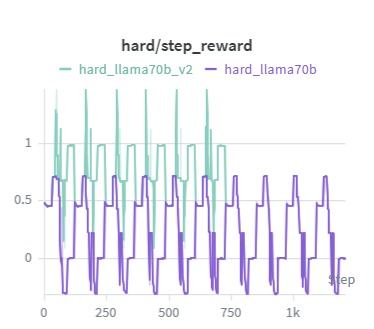
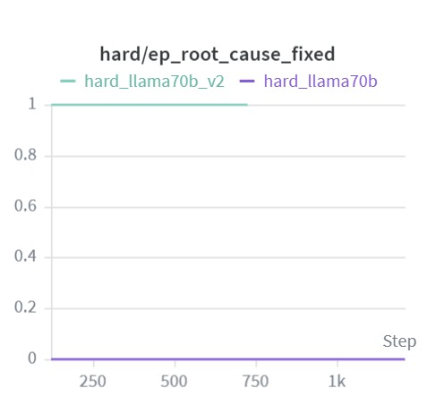
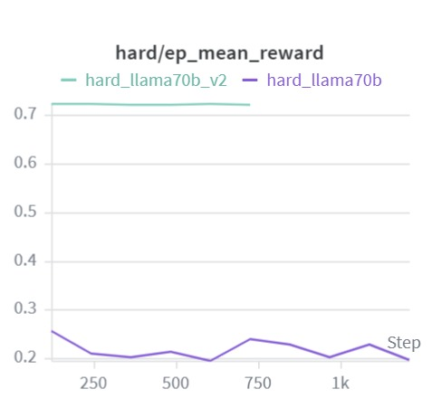
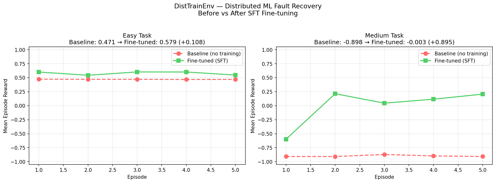

# Teaching a Language Model to Save a Dying Cluster

*How we built a reinforcement learning environment and trained LLaMA-3.3-70B to manage distributed ML training as an autonomous SRE agent.*

---

## 3 AM. The cluster is on fire.

Not literally. But if you've ever run a multi-node training job overnight, you know the specific dread of waking up to a wall of red.

```
node_3: CRASHED
node_7: SLOW  — throughput 30%
gradient_staleness: 0.87
loss_diverging: True
```

A 70B parameter model has been training for six hours. Somewhere in your 8-node ring, node_2's memory has been quietly climbing — 60%, 70%, 80% — while you slept. By the time node_7 slowed to a crawl and the loss started spiking, the damage was already done. The root cause and the symptom were two different nodes. You restarted the wrong one.

We wanted to see if a language model could do better. So we built an environment to find out.

---

## The Environment

**DistTrainEnv** simulates a distributed training cluster: 8 nodes in a ring all-reduce topology. Every step, the agent observes cluster state and picks an action — restart a crashed node, remove a straggler from the ring, reduce batch size on an OOM node, checkpoint, or hold.

Three tasks of increasing difficulty. Easy: node_3 crashes, restart it. Medium: node_5 is running at 30% speed and needs to be removed, but there's a healthy high-memory node sitting nearby that looks suspicious. Hard: a cascading OOM fault where node_2 is the silent root cause and node_7 is the visible symptom that everyone targets first.

The hard task scores 0.30 for fixing node_7. It scores 1.0 for catching node_2 early. The environment rewards correct reasoning, not just visible action.

### System Design

```
┌──────────────────────────┐     ┌─────────────────────────────┐     ┌─────────────────────────┐
│      Fault Injector      │────▶│       Ring Cluster Sim      │────▶│       LLM / RL Agent    │
│                          │     │                             │     │                         │
│ • Deterministic per task │     │ • 8 nodes, ring topology    │     │ • Reads JSON observation│
│ • crash / straggler / OOM│     │ • Throughput = min(nodes)   │     │ • Outputs JSON action   │
│ • Root cause + symptoms  │     │ • Loss curve dynamics       │     │ • [START][STEP][END] log│
└──────────────────────────┘     │ • Gradient staleness        │     └─────────────────────────┘
                                 └──────────────┬──────────────┘
                                                │
                         ┌──────────────────────▼──────────────────────┐
                         │                   Graders                   │
                         │                                             │
                         │  easy   → throughput + loss + step speed    │
                         │  medium → detection speed + throughput      │
                         │  hard   → root cause fix + early detection  │
                         └─────────────────────────────────────────────┘
```

The simulation is pure Python — no real Docker containers, no GPU, no external APIs in the environment. One episode runs in milliseconds.

### Observation Space

Each step the agent receives a full cluster snapshot:

```json
{
  "nodes": [
    {
      "id": "node_2",
      "status": "slow",
      "memory": 0.81,
      "throughput": 0.6,
      "latency": 5.2,
      "in_ring": true
    }
  ],
  "job": {
    "step": 4,
    "loss": 2.4471,
    "expected_loss": 2.3812,
    "cluster_throughput": 0.75,
    "gradient_staleness": 0.12,
    "loss_diverging": false
  },
  "alerts": ["INFO: node_2 memory elevated (81%)"],
  "step": 4,
  "task_id": "hard"
}
```

| Signal | Threshold | Meaning |
|---|---|---|
| `memory` | > 0.65 | early OOM warning — act now |
| `memory` | > 0.90 | critical — crash imminent |
| `gradient_staleness` | > 0.30 | training degrading silently |
| `loss_diverging` | true | serious — immediate action required |

### Action Space

| Action | Description | Requires `target_node` |
|---|---|---|
| `restart_node` | bring a crashed node back online | yes |
| `remove_from_ring` | remove a slow node from all-reduce | yes |
| `reduce_batch` | halve batch size to ease memory pressure | yes |
| `checkpoint` | save training state | no |
| `inspect` | get diagnostics on a specific node | yes |
| `noop` | do nothing | no |

### Reward Function

```
reward = 0.35 × throughput_score        # cluster steps/sec vs baseline
       + 0.35 × loss_health_score        # actual loss vs expected trajectory
       + early_detection_bonus           # acted before fault became critical
       + causal_fix_bonus                # fixed root cause, not just symptom
       + penalty                         # restarting healthy nodes, invalid actions
```

The `early_detection_bonus` and `causal_fix_bonus` are what create meaningful score variance between naive and smart agents, especially on the hard task.

### Hard Task — Cascading OOM

```
node_2 OOM (step 1, silent) ──▶ slow + retries ──▶ node_7 straggler (step 5)
                                                           │
                                               gradient staleness builds
                                                           │
                                                   loss diverges
```

A naive agent fixes node_7 (the visible symptom) and scores ~0.30. A smart agent traces the causal chain to node_2, acts before memory exceeds 0.90, and scores full marks.

---

## The Agent: LLaMA-3.3-70B

We used **LLaMA-3.3-70B-Instruct** throughout. The project ran in two phases: first as a prompted agent, then fine-tuned with SFT using Unsloth.

---

## Phase 1: Prompting

Per-task system prompts encode the fault logic for each scenario. At every step the agent receives nodes sorted by memory risk, a live analysis block with root-cause hints, and the last 5 actions with their rewards. Temperature at 0.2 for consistency.

For the hard task, the system prompt explicitly lays out the causal chain:

```
FAULT CHAIN:
- node_2 memory climbs ~6% per step from step 1 (SILENT)
- At step 5: node_7 becomes slow (downstream SYMPTOM)

ROOT CAUSE = node_2. SYMPTOM = node_7.
Fixing node_7 only = 0.30 score. Fixing node_2 early = 1.0 score.
```

### What the Charts Actually Showed

Easy and medium tasks ran cleanly enough. The hard task was a different story.

The per-step reward never settled. Both the base prompted agent and the v2 version with tighter prompts oscillated between 0 and 1 across every episode with no stable trend emerging.

<p align="center">
  
  <br><em>hard/step_reward — both prompted agents volatile throughout ~1200 steps</em>
</p>

The root cause chart made the problem concrete. The base agent flatlined at 0 for almost the entire run, occasionally spiking toward 0.4 before dropping straight back down. The v2 agent never triggered the causal fix signal at all. Over a thousand steps, neither version reliably identified node_2 as the source of the fault.

<p align="center">
  
  <br><em>hard/ep_root_cause_fixed — base agent near zero throughout, v2 never registers</em>
</p>

Mean episode reward told the same story. The base agent sat around 0.2–0.4 with high noise. The v2 agent, despite the more carefully engineered prompt, landed slightly lower and flatter. Prompt iteration was not moving the needle.

<p align="center">
  
  <br><em>hard/ep_mean_reward — neither run converges, v2 no better than base</em>
</p>

The jank in these curves came from real engineering problems — API rate limits stalling episodes mid-run, malformed JSON responses causing silent fallbacks to `noop` — but fixing those didn't fix the underlying issue. Even in clean runs, the agent couldn't consistently reason its way to node_2 from a prompt alone.

That's what pushed us into Phase 2.

---

## Phase 2: Fine-Tuning with SFT + Unsloth

Rather than trying to prompt the model into consistent behavior, we fine-tuned using **SFT** (Supervised Fine-Tuning) via Unsloth on a free Colab T4 GPU.

We generated training data from the environment — correct `(observation, action)` pairs across the easy and medium tasks where the agent had demonstrated the right behavior in Phase 1 — and fine-tuned the model to internalize those decisions rather than derive them from scratch at inference time.

```python
model = FastLanguageModel.get_peft_model(
    model,
    r                          = 16,
    lora_alpha                 = 32,
    use_gradient_checkpointing = "unsloth",
)
```

LoRA rank 16 keeps roughly 1% of parameters trainable. Training ran for 3 epochs over ~250 steps with loss descending from 0.15 to around 0.12.

### Results

<p align="center">
  
  <br><em>Before vs After SFT fine-tuning — easy and medium tasks, 5 evaluation episodes each</em>
</p>

On the easy task, fine-tuning pushed mean episode reward from 0.471 to 0.579, a +0.108 gain.

The medium task is the more striking result. The baseline prompted agent scored -0.898 — actively making things worse by triggering false alarm penalties repeatedly. After fine-tuning, the same model scored -0.003. A +0.895 swing, going from net harmful to essentially neutral behavior in a task it had previously failed completely.

| Task | Baseline | Fine-tuned (SFT) | Delta |
|---|---|---|---|
| Easy — mean reward | 0.471 | 0.579 | +0.108 |
| Medium — mean reward | -0.898 | -0.003 | +0.895 |

The hard task remains the open problem. The root cause fix rate on the cascading OOM scenario is what we'd push further with curriculum training and more compute.

---

## Evaluation Results (Phase 1 — LLaMA-3.3-70B via Groq)

| Task | Score |
|---|---|
| easy | 0.9722 |
| medium | 0.9809 |
| hard | 0.5754 |
| **weighted** | **0.7764** |

Weights: easy 0.20, medium 0.30, hard 0.50

---

## What We Took Away

The environment design took longer than the training code. Getting the reward function to separately credit causal fixes, penalize false alarms, and score root-cause resolution at a higher rate than symptom resolution was where most of the iteration happened.

Phase 1 failing on the hard task was clarifying. The model had the reasoning capacity — it demonstrated that in the episodes where it got node_2 right — but prompting alone couldn't make that behavior reliable. SFT gave it a way to encode the correct decision pattern rather than re-derive it from a prompt every time.

The medium task result was the most surprising outcome of the project. A model that was actively hurting cluster health under prompting became a neutral agent after fine-tuning. That's a bigger behavioral shift than we expected from a LoRA adapter trained on a few hundred examples.

---

## What's Next

- **Hard task fine-tuning** — generate correct trajectories for the cascading OOM scenario and add them to the training set
- **Curriculum training** — carry the LoRA adapter from easy to medium to hard sequentially
- **GRPO** — now that we have a fine-tuned baseline, online RL with environment reward signals is the natural next step
- **Real cluster integration** — replace the simulation with live NCCL metrics from an actual training run

---

## Folder Structure

```
DistTrainEnv/
│
├── environment/
│   ├── schema.py          # shared data contract (NodeState, JobState, Action, Reward)
│   ├── node.py            # single worker node state machine
│   ├── job.py             # training job + loss curve dynamics
│   ├── faults.py          # fault injection engine
│   ├── ring_cluster.py    # main simulation
│   ├── reward.py          # shaped reward computation
│   ├── models.py          # openenv-compliant pydantic models
│   └── env.py             # openenv api (reset / step / state)
│
├── tasks/
│   └── task_configs.py    # task metadata + grading weights
│
├── graders/
│   ├── grader_easy.py
│   ├── grader_medium.py
│   ├── grader_hard.py
│   └── run_graders.py
│
├── assets/
│   ├── hard_step_reward.jpeg
│   ├── hard_ep_root_cause_fixed.jpeg
│   ├── hard_ep_mean_reward.jpeg
│   └── before_after_sft.png
│
├── inference.py           # llm agent loop
├── app.py                 # fastapi server (openenv http api)
├── openenv.yaml
├── Dockerfile
├── requirements.txt
└── README.md
```

---

## Running the Project

**Install dependencies**

```bash
pip install -r requirements.txt
```

**Dry run (no API key needed)**

```bash
python inference.py --dry-run
```

**Run with a real LLM**

```bash
HF_TOKEN=gsk_... python inference.py
HF_TOKEN=gsk_... python inference.py --task hard
```

**Start the API server**

```bash
python app.py
```

| Method | Endpoint | Description |
|---|---|---|
| POST | `/reset` | reset environment, returns initial observation |
| POST | `/step` | apply action, returns observation + reward + done |
| GET | `/state` | full internal state |
| GET | `/health` | health check |
| GET | `/tasks` | list available tasks |

**Docker**

```bash
docker build -t disttrainenv .
docker run -p 7860:7860 -e HF_TOKEN=gsk_... disttrainenv
```

---

*Built with LLaMA, Unsloth, TRL, and Weights & Biases.*
